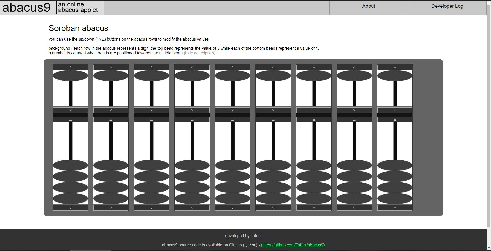
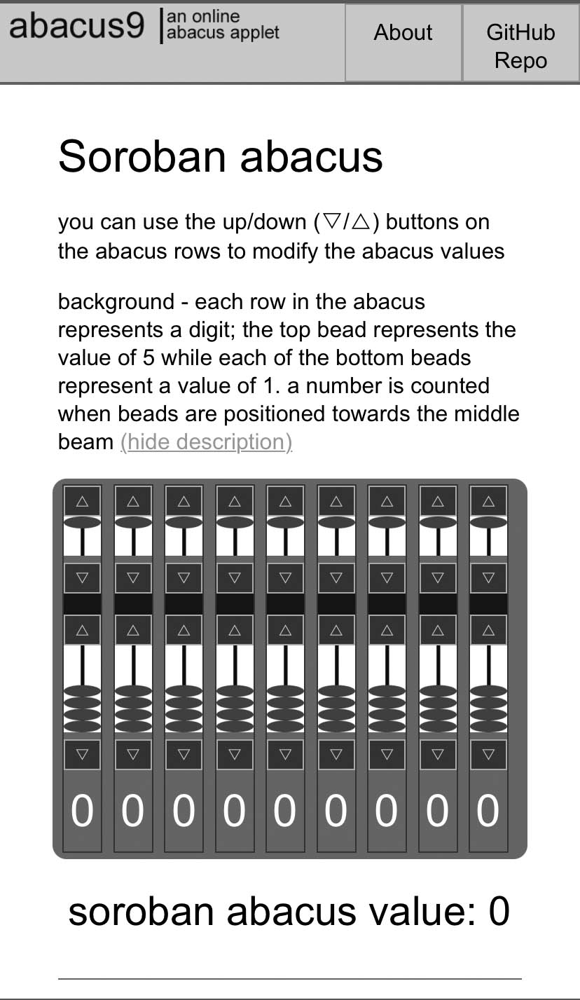

# abacus9 | an online abacus applet - [abacus9.com](https://abacus9.com/)

-----

## usage
applet can be run in a web browser by checking out the repo and opening `index.html` in a web browser

## shareable abacus links
- soroban (そろばん) - https://abacus9.com/#soroban
- suanpan (算盘) - https://abacus9.com/#suanpan
- binary abacus - https://abacus9.com/#binary

## features
- 3 abacus types, each with 9 columns
- soroban (そろばん) - 1 upper bead / 4 lower beads
- suanpan (算盘) - 2 upper beads / 5 lower beads
- binary abacus - 1 bead
- practice exercise - setting the abacus to a random value
- responsive viewport and styling to support desktop and mobile devices
- Chinese language version - [https://abacus9.com/zh/]
- Japanese language version - [https://abacus9.com/jp/]

## feature wishlist
- (game) addition/subtraction arithmetic exercises
- (code) refactoring

## Mobile preview:

